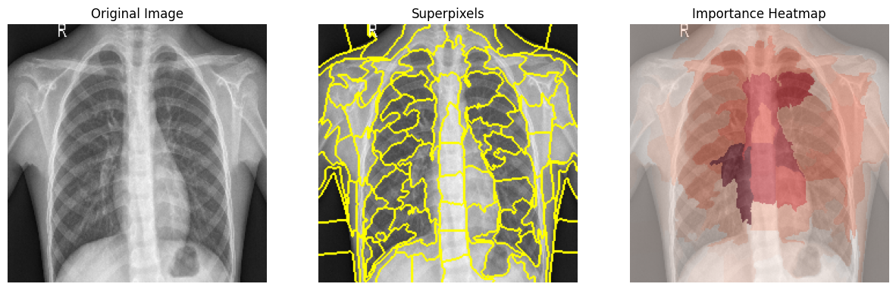
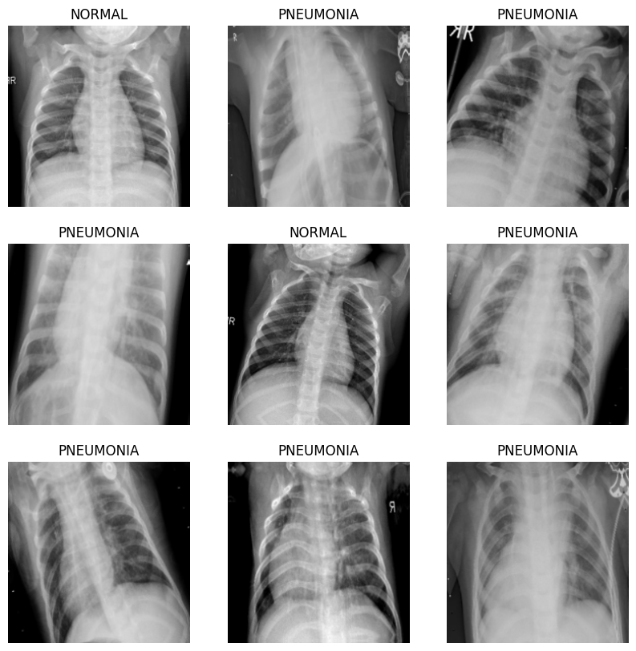
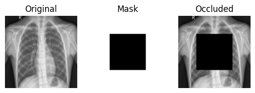
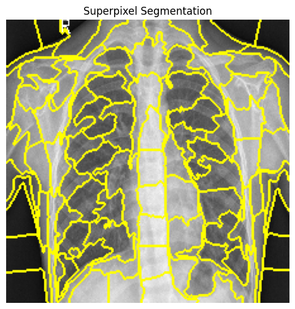
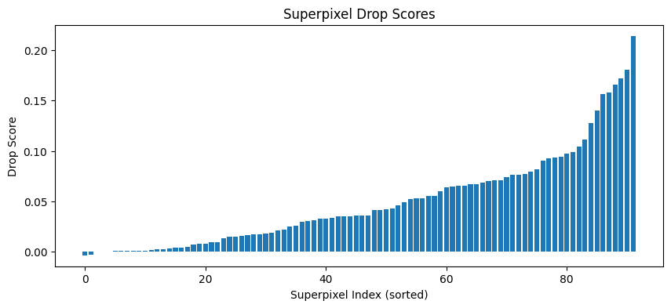

# Chest X-Ray Pneumonia Detection using Deep Learning

**Python • TensorFlow • Keras • ResNet50 • Computer Vision • Explainable AI**

## Overview

This project investigates the application of deep learning for detecting pneumonia from chest X-ray images.

A transfer learning pipeline based on **ResNet50** was developed to classify chest X-rays into **Normal** and **Pneumonia** categories. Beyond model training, the project explores explainability techniques to better understand which image regions contribute most strongly to model predictions.

---

## Objectives

The objectives of this project were to:

- Develop a deep learning pipeline for chest X-ray classification.
- Apply transfer learning using a pretrained ResNet50 model.
- Evaluate model performance on unseen test images.
- Investigate model behaviour using explainable AI techniques.
- Visualise important image regions through occlusion and superpixel analysis.

---

## Dataset

This project uses the **Chest X-Ray Pneumonia** dataset, containing labelled chest X-ray images divided into:

- Training set
- Validation set
- Test set

Classes:

- Normal
- Pneumonia

Images were resized to **224 × 224 pixels**, normalised, and augmented prior to model training.

Original dataset:

https://www.kaggle.com/datasets/paultimothymooney/chest-xray-pneumonia

---

## Methodology

The project follows the workflow below:

- Data loading and preprocessing
- Image augmentation
- Transfer learning with ResNet50
- Model training
- Performance evaluation
- Explainability analysis

---

## Model

The classification model is based on:

- ResNet50 pretrained on ImageNet
- Global Average Pooling
- Dense classification layers
- Dropout regularisation

The network was implemented using **TensorFlow** and **Keras**.

---

## Explainability

To improve model interpretability, several explainability methods were implemented:

- Pixel Occlusion
- Superpixel Segmentation (SLIC)
- Occlusion Ranking
- Heatmap Visualisation

These techniques highlight image regions that most strongly influence the model's predictions.

---

## Results

The trained ResNet50 model successfully classified chest X-ray images into **Normal** and **Pneumonia** categories while demonstrating the use of explainability techniques for interpreting predictions.

### Model Results



---

### Sample Predictions

Example chest X-ray images used throughout the analysis.



---

### Pixel Occlusion

Pixel occlusion highlights the image regions that most strongly influence the model's predictions.



---

### Superpixel Segmentation

Superpixel segmentation groups neighbouring pixels into meaningful regions before evaluating their importance.



---

### Superpixel Importance

The figure below illustrates the importance ranking of individual superpixels based on their influence on model predictions.



---

## Technologies

- Python
- TensorFlow
- Keras
- ResNet50
- NumPy
- pandas
- OpenCV
- scikit-image
- Matplotlib
- Seaborn
- Jupyter Notebook

---

## Installation

Install the required packages:

```bash
pip install -r requirements.txt
```

Open the notebook:

```text
chest_xray_pneumonia_detection.ipynb
```

---

## Repository Structure


## Repository Structure

```text
chest-xray-pneumonia-detection/

├── chest_xray/
│   └── chest_xray/
│       ├── train/
│       ├── test/
│       └── val/
│
├── figures/
│   ├── model_results.png
│   ├── pixel_occlusion.png
│   ├── sample_visualisation.png
│   ├── superpixel_dropscores.png
│   └── superpixel_segmentation.png
│
├── chest_xray_pneumonia_detection.ipynb
├── README.md
└── requirements.txt

---

## Author

**Yoana Petrova**

MSc Data Science & Society  
Tilburg University
